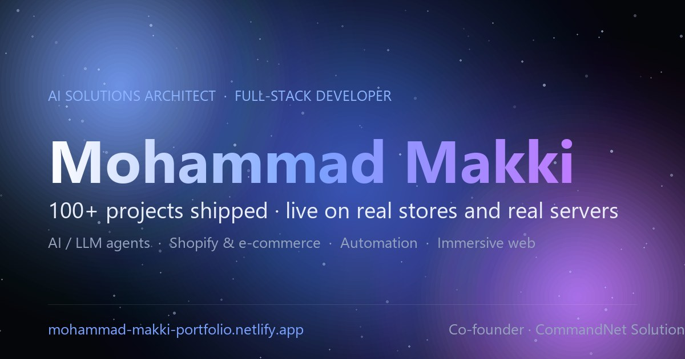

# Mohammad Makki · AI Solutions Architect & Full-Stack Developer

**Live site → [mohammad-makki-portfolio.netlify.app](https://mohammad-makki-portfolio.netlify.app/)**

[](https://mohammad-makki-portfolio.netlify.app/)
[](https://mohammad-makki-portfolio.netlify.app/assets/docs/Mohammad_Makki_CV.pdf)



Full-stack & AI developer from Lebanon. 100+ shipped projects across AI/LLM agents,
Shopify and automation. Co-founder & Web-Dev lead of CommandNet Solutions.

## What's in the site

- **Featured work**: AI trading platform, WhatsApp ordering agents, AutoScope AI, Odoo ERP builds, Shopify stores, and 40+ more builds, each with a case-file viewer (screens, videos, links)
- **GenAI studio**: AI-generated product films and real-estate staging
- **R&D**: IEEE paper, engineering projects, technical write-ups
- **Bilingual**: full English / Arabic (RTL) switch, including project content
- **Interactive extras**: 3D robot + chat assistant, scroll-driven cube gallery, interactive globe, light/dark themes with sound design

## Tech

| Layer | Stack |
|---|---|
| Front end | Hand-written single-file HTML/CSS/JS, GSAP + ScrollTrigger, Lenis smooth scroll, Three.js, Web Audio, Web Speech |
| Back end | Netlify Functions (Node, ES modules), Netlify Edge Functions |
| Data | Netlify Blobs (self-hosted visitor analytics, no third-party trackers) |
| SEO / perf | Open Graph + JSON-LD, sitemap, `llms.txt`, no render-blocking scripts, cache headers |

## Repo layout

```
_publish/            the deployed static site (index.html + assets)
netlify/functions/   /api/collect (analytics beacon) and /admin (password-protected dashboard)
netlify/edge-functions/gate.mjs   edge geo-gate
netlify/lib/         shared analytics storage logic
test/                analytics tests  (npm run test:analytics)
```

See [ANALYTICS.md](ANALYTICS.md) for how the self-hosted analytics works.

## Run locally

```bash
npx serve _publish
```

## Contact

- Email: makki.51x3@gmail.com
- Portfolio: https://mohammad-makki-portfolio.netlify.app/
